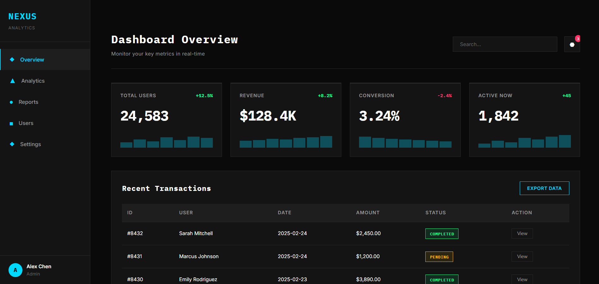
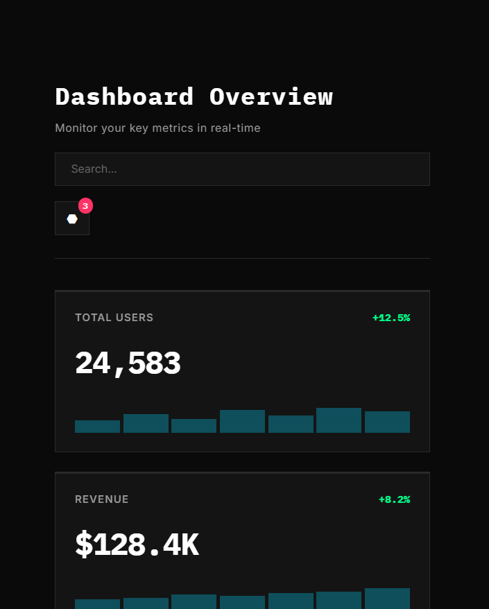

# NEXUS Dashboard

A modern, dark-themed admin dashboard built with pure HTML and CSS. Features a clean industrial aesthetic with cyan accents and smooth animations.

(./screenshots/dashboard-preview.png)

##  Features

- **Dark Industrial Theme** - Professional black/gray color scheme with cyan accents
- **Responsive Design** - Fully responsive on desktop, tablet, and mobile
- **Pure CSS** - No JavaScript frameworks, just clean HTML/CSS
- **Data Visualization** - Mini charts, stat cards, and trend indicators
- **Interactive Components** - Hover effects, transitions, and smooth animations
- **Modern Typography** - IBM Plex Mono + Inter font pairing
- **Accessible** - Semantic HTML and proper contrast ratios

##  Live Demo

[View Live Demo](https://goodness-taiwo.github.io/Nexus-dashboard/)

##  Screenshots

### Desktop View


### Mobile View


##  Technologies Used

- HTML5
- CSS3
- Google Fonts (IBM Plex Mono, Inter)
- CSS Grid & Flexbox
- CSS Animations

##  Installation

1. Clone the repository
```bash
git clone https://github.com/goodness-taiwo/nexus-dashboard.git
```

2. Navigate to the project directory
```bash
cd nexus-dashboard
```

3. Open `index.html` in your browser
```bash
open index.html
```

Or simply drag the HTML file into your browser.

##  Design Choices

### Color Palette
- **Background:** `#0A0A0A` (Deep black)
- **Surface:** `#141414` (Dark gray)
- **Accent:** `#00D9FF` (Cyan blue)
- **Success:** `#00FF88` (Green)
- **Warning:** `#FFB800` (Orange)
- **Danger:** `#FF3366` (Red)

### Typography
- **Display Font:** IBM Plex Mono (monospace for technical feel)
- **Body Font:** Inter (clean, readable sans-serif)


##  Project Structure
```
nexus-dashboard/
│
├── index.html          # Main HTML file
├── style.css    # All styling
├── screenshots/            # Screenshot images
│   ├── dashboard-preview.png
│   ├── desktop-view.png
│   └── mobile-view.png
└── README.md              # Project documentation
```

## 🎯 Key Components

### Sidebar Navigation
- Fixed position sidebar
- Active state indicators
- Icon + text navigation
- User profile section

### Stats Cards
- Real-time metrics display
- Mini bar charts (pure CSS)
- Trend indicators (positive/negative)
- Hover animations

### Data Table
- Sortable columns
- Status badges
- Action buttons
- Responsive horizontal scroll

### Activity Feed
- Timeline-style updates
- Icon indicators
- Timestamp display

##  Future Improvements

- [ ] Add dark/light mode toggle
- [ ] Implement JavaScript for interactive charts
- [ ] Add filters to data table
- [ ] Create additional dashboard pages
- [ ] Add authentication UI
- [ ] Implement mobile menu toggle

##  What I Learned

- Advanced CSS Grid layouts for responsive dashboards
- Creating data visualizations with pure CSS
- Implementing consistent design systems with CSS variables
- Optimizing for performance without JavaScript
- Building professional admin interfaces

##  Contributing

Contributions are welcome! Feel free to:
1. Fork the project
2. Create your feature branch (`git checkout -b feature/AmazingFeature`)
3. Commit your changes (`git commit -m 'Add some AmazingFeature'`)
4. Push to the branch (`git push origin feature/AmazingFeature`)
5. Open a Pull Request

##  License

This project is open source and available under the [MIT License](LICENSE).

## 👤 Author

**Goodness Taiwo**
- GitHub: [@goodness-taiwo]
- Twitter: [@GoodnessTaiwo_]

##  Acknowledgments

- Design inspiration from modern SaaS dashboards
- Icons: Unicode geometric shapes
- Fonts: Google Fonts

---

⭐ Star this repo if you found it helpful!